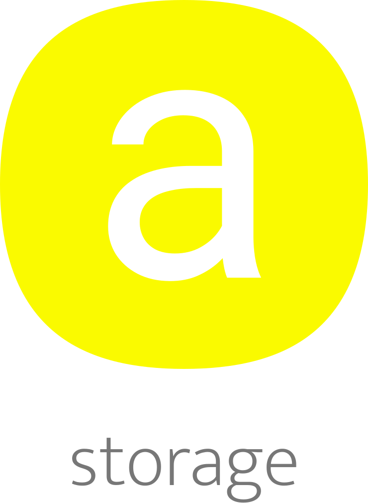

</br >
</br >

<p align='center'>
  <a target='_blank' rel='noopener noreferrer' href='#'>
    
  </a>
</p>

<h1 align='center'>AMAUI Storage</h1>

<p align='center'>
  Storage
</p>

<br />

<h3 align='center'>
  <sub>MIT license&nbsp;&nbsp;&nbsp;&nbsp;</sub>
  <sub>Production ready&nbsp;&nbsp;&nbsp;&nbsp;</sub>
  <sub>UMD 5.4kb gzipped&nbsp;&nbsp;&nbsp;&nbsp;</sub>
  <sub>100% test cov&nbsp;&nbsp;&nbsp;&nbsp;</sub>
  <sub>Browser</sub>
</h3>

<p align='center'>
    <sub>Very simple code&nbsp;&nbsp;&nbsp;&nbsp;</sub>
    <sub>Modern code&nbsp;&nbsp;&nbsp;&nbsp;</sub>
    <sub>Junior friendly&nbsp;&nbsp;&nbsp;&nbsp;</sub>
    <sub>Typescript&nbsp;&nbsp;&nbsp;&nbsp;</sub>
    <sub>Made with :yellow_heart:</sub>
</p>

<br />

## Getting started

### Add

```sh
  // yarn
  yarn add @amaui/storage

  // npm
  npm install @amaui/storage
```

### Use

```javascript
  import AmauiStorage from '@amaui/storage';

  const amauiStorage = new AmauiStorage();

  const value = { a: 4 };

  // Add
  amauiStorage.add('a', value);

  // Get
  amauiStorage.get('a');

  // { a: 4 }

  // Remove
  amauiStorage.remove('a');

  amauiStorage.get('a');

  // null
```

### Dev

Install

```sh
  yarn
```

Test

```sh
  yarn test
```

### Prod

Build

```sh
  yarn build
```

### Docs

Might be soon...
